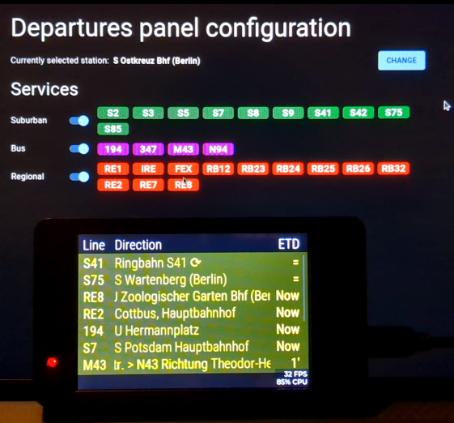

# Welcome to SunTransit

An [ESP32](https://www.espressif.com/en/products/socs/esp32) project to monitor departures of the [Berliner Verkehrsbetriebe (BVG)](https://www.bvg.de) using Sunton development boards.

  

## Features

- Supports Sunton [3248S035C](https://www.openhasp.com/0.7.0/hardware/sunton/esp32-3248s035/) (3.5", 480x320px) and [8048S070C](https://www.openhasp.com/0.7.0/hardware/sunton/esp32-8048s0xx/) (7.0", 800x480px).
- WiFi 🛜 provisioning via the "ESP SoftAP Provisioning" app 📱
- Web based configuration
- Selection of station to show departures from (BVG)
- Selection of products to show departures of 🚌🚇🚉🚆

## Acknowledgments

The public transport data comes from the [https://v6.bvg.transport.rest/](https://v6.bvg.transport.rest/) API, show some love to [@derhuerst](https://github.com/derhuerst).
